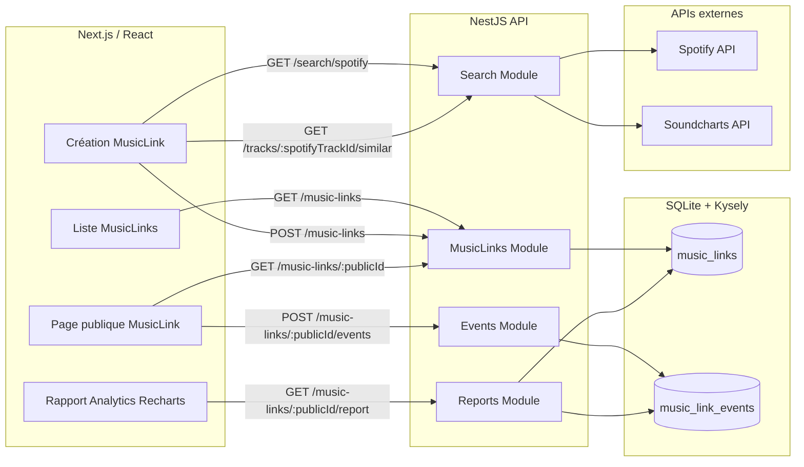

# MusicLink Analytics

Mini-application full stack pour créer des pages publiques de tracks musicales et suivre leurs performances : vues, clics par plateforme et reporting dans le temps.

## Stack

- Frontend : Next.js, React, TypeScript, Mantine UI, Recharts
- Backend : NestJS, TypeScript
- Database : SQLite avec Kysely
- APIs externes : Spotify Search API et Soundcharts, avec fallback Spotify mocké si besoin

## Fonctionnalités

- Rechercher une track Spotify
- Récupérer des liens plateformes via Soundcharts si configuré
- Générer un MusicLink public
- Lister les MusicLinks créés
- Tracker les vues de page publique
- Tracker les clics plateforme
- Afficher un rapport analytics avec tableaux et graphiques


## Installation

```bash
npm install
```

Le `postinstall` installe aussi les dépendances `frontend` et `backend`.

## Variables d'environnement

Copier les fichiers d'exemple :

```bash
cp backend/.env.example backend/.env
cp frontend/.env.example frontend/.env.local
```

Backend :

```env
PORT=3001
FRONTEND_URL=http://localhost:3000
DATABASE_URL=./data/musiclink.sqlite

SOUNDCHARTS_APP_ID=
SOUNDCHARTS_API_KEY=

SPOTIFY_CLIENT_ID=
SPOTIFY_CLIENT_SECRET=
```

Frontend :

```env
NEXT_PUBLIC_API_URL=http://localhost:3001
```

Les tokens restent côté backend et ne sont jamais exposés au frontend.

Liens utiles pour récupérer les credentials :

- Spotify Developer Dashboard : https://developer.spotify.com/dashboard
- Spotify Client Credentials Flow : https://developer.spotify.com/documentation/web-api/tutorials/client-credentials-flow
- Soundcharts API access : https://help.soundcharts.com/en/articles/10091349-how-can-i-get-access-to-soundcharts-api
- Soundcharts API docs : https://doc.api.soundcharts.com/api/v2/doc

## Lancement

```bash
npm run dev
```

- Frontend : http://localhost:3000
- Backend : http://localhost:3001

## Scripts utiles

```bash
npm run build
npm run lint
npm test
```

## Parcours utilisateur

1. Depuis la page principale, rechercher une track Spotify.
2. Sélectionner une track.
3. Le backend tente de récupérer les liens plateformes via Soundcharts.
4. Si Soundcharts n'est pas configuré ou échoue, seules les plateformes réellement disponibles sont affichées.
5. Créer le MusicLink.
6. Ouvrir la page publique `/music-link/:publicId`.
7. Consulter le rapport `/music-link/:publicId/report`.

## Architecture



## Backend

Les routes principales sont :

- `GET /music-links`
- `POST /music-links`
- `GET /music-links/:publicId`
- `POST /music-links/:publicId/events`
- `GET /music-links/:publicId/report`
- `GET /search/spotify?query=...`
- `GET /tracks/:spotifyTrackId/similar`

Le projet utilise un `publicId` non prédictible pour les URLs publiques. L'id SQL auto-incrémenté reste interne à la base et sert aux relations.

La base SQLite est initialisée au démarrage via Kysely dans `DatabaseService`. Pour un projet plus long terme, des migrations versionnées seraient préférables.

## Frontend

Le frontend est organisé par feature :

```txt
frontend/src/features/music-links
├── api.ts
├── components
├── hooks
├── types.ts
└── utils.ts
```

Les pages Next restent fines et délèguent la logique aux hooks et composants de la feature.

## Gestion des APIs externes

Spotify :

- Le backend utilise `SPOTIFY_CLIENT_ID` et `SPOTIFY_CLIENT_SECRET` pour obtenir
  automatiquement un access token avec le Client Credentials Flow.
- Le token est mis en cache, renouvelé avant expiration et régénéré après un
  éventuel `401` de Spotify.
- `SPOTIFY_ACCESS_TOKEN` reste accepté comme solution manuelle de compatibilité
  si les client credentials ne sont pas renseignés.
- Si le token est absent ou si l'appel échoue, le backend retourne des tracks mockées.

Soundcharts :

- Le backend envoie automatiquement `SOUNDCHARTS_APP_ID` et
  `SOUNDCHARTS_API_KEY` dans les en-têtes requis à chaque appel. Ces credentials
  Soundcharts sont stables et n'ont pas de refresh OAuth à effectuer.
- L'ancien nom `SOUNDCHARTS_API_TOKEN` reste accepté pour compatibilité.
- Si Soundcharts retourne une URL exploitable, elle est utilisée directement.
- Si Soundcharts ne retourne qu'un identifiant exploitable, le backend construit une URL plateforme.
- Si Soundcharts ne retourne rien d'exploitable, aucune plateforme non confirmée n'est affichée.

Ce choix permet de tester le projet sans dépendre de credentials externes, tout en gardant une architecture branchable.

## Limites connues

- Pas d'authentification, conformément au sujet.
- Pas de migrations versionnées, le schéma est créé au démarrage.
- Les mocks Spotify sont volontairement simples.
- Les événements analytics ne dédupliquent pas les vues d'un même visiteur.
- Les routes backend ne sont pas préfixées par `/api`; le README documente les routes réelles.

## Améliorations possibles

- Ajouter des migrations Kysely versionnées.
- Ajouter des tests e2e sur le parcours complet.
- Ajouter une vraie gestion OAuth Spotify.
- Enrichir le mapping Soundcharts selon les plateformes disponibles.
- Ajouter des filtres de dates sur le reporting.
- Ajouter un mode seed pour générer des données de demo.
